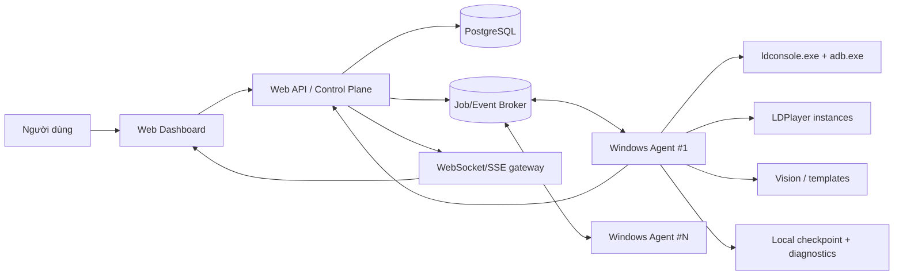
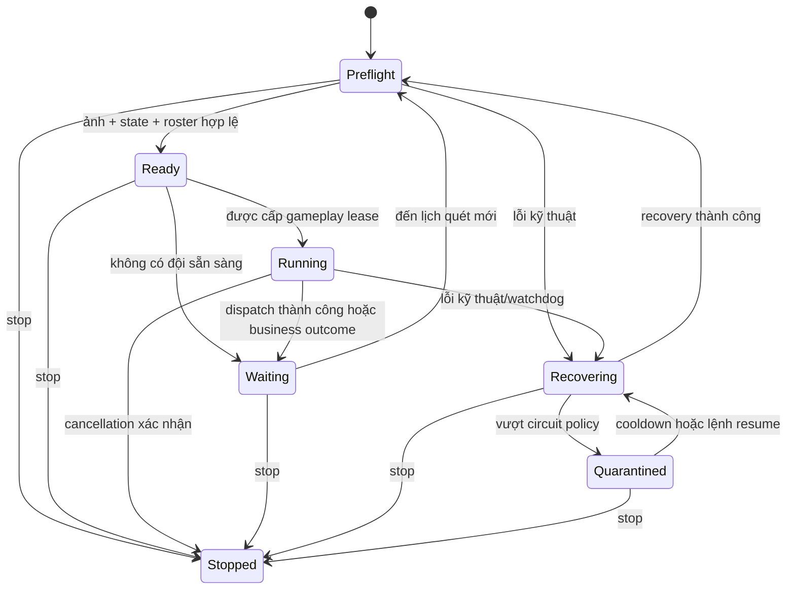
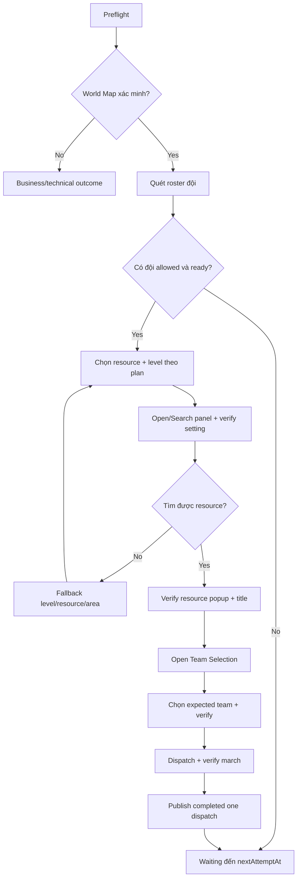

# Đặc tả Farm Automation Web — Infinity Kingdom

> Mục tiêu: dựng lại farm automation hiện tại thành một hệ thống điều khiển bằng web, vẫn chạy thao tác LDPlayer/ADB trên máy Windows có emulator. Tài liệu này là nguồn yêu cầu kỹ thuật và vận hành cho phiên bản web.

## 1. Phạm vi và nguyên tắc

### 1.1. Phạm vi phiên bản đầu

- Quản lý tối đa 25 LDPlayer đã được gán cho một Windows Agent.
- Farm liên tục, độc lập theo từng thiết bị.
- Lựa chọn tài nguyên: Sắt, Mỏ đá, Rừng, Đất nông nghiệp.
- Thứ tự cấp mặc định: 7 → 6 → 5; cho phép cấu hình theo farm profile.
- Quét đội sẵn sàng, chỉ điều đội được phép và xác nhận đã xuất quân.
- Xử lý các kết quả game có chủ đích: không có tài nguyên, đổi vùng tìm kiếm, đội bận, kho đầy, hết kế hoạch.
- Xử lý lỗi kỹ thuật theo từng thiết bị: retry, recovery ladder, circuit breaker, quarantine.
- Dashboard thời gian thực, log/audit, checkpoint và cảnh báo tổng hợp.

### 1.2. Ngoài phạm vi

- Không đưa Facebook, proxy, login Facebook, OCR/Tesseract hoặc các workflow legacy vào hệ thống mới.
- Không cho web server thao tác ADB/LDPlayer trực tiếp qua Internet.
- Không dùng tọa độ cứng khi đã có bounds từ template match.
- Không thực hiện thao tác game từ trạng thái `Unknown`.
- Không tự bấm đóng/xác nhận các dialog chưa có workflow và template được duyệt.

### 1.3. Quy tắc an toàn gameplay

1. Tất cả input phải thuộc một device lease độc quyền.
2. Trước mỗi `Tap` production: chụp ảnh mới, match lại template, kiểm tra bounds, tap tâm bounds.
3. Sau input phải xác minh state/màn hình kết quả; gọi input thành công không đồng nghĩa game đã thành công.
4. Overlay/dialog cụ thể có độ ưu tiên cao hơn state nền (World Map).
5. Chờ, retry, queue, lock và polling đều có timeout, giới hạn retry và cancellation token/job cancellation.
6. Phân biệt `business outcome` với `technical failure`; chỉ technical failure mới kích hoạt recovery.

## 2. Kiến trúc mục tiêu



### 2.1. Control plane (web)

Control plane chịu trách nhiệm về người dùng, cấu hình, lịch chạy, phân phối job, trạng thái tổng hợp và lịch sử. Nó không nắm handle ADB, không gửi tap/screenshot trực tiếp.

Các dịch vụ tối thiểu:

| Thành phần | Trách nhiệm |
| --- | --- |
| Web Dashboard | Quản lý agent/device/profile/run, xem tiến trình thời gian thực, dừng/chạy lại/quarantine. |
| API | Xác thực, phân quyền, validate request, persist command và query. |
| Scheduler | Tạo farm run hoặc yêu cầu thao tác theo lịch; không chạy gameplay. |
| Job/Event Broker | Giao lệnh bền vững và nhận event từ agent; ví dụ RabbitMQ, NATS hoặc Redis Streams. |
| PostgreSQL | Nguồn dữ liệu chính cho cấu hình, run, event, audit và aggregate. |
| WebSocket/SSE gateway | Đẩy trạng thái đã coalesce tới browser. |
| Object storage | Lưu screenshot/diagnostic đã được cấp quyền, có retention. |

### 2.2. Windows Agent (data plane)

Agent là Windows Service hoặc desktop tray app chạy cùng máy với LDPlayer. Agent kết nối outbound tới control plane/broker bằng TLS, vì vậy không cần mở ADB ra Internet.

Agent gồm các module:

- `AgentHost`: đăng ký agent, heartbeat, nhận command, gửi event.
- `DeviceManager`: đọc instance từ `ldconsole`, kiểm tra cấu hình 1280×720, DPI 240 và Debug ADB local.
- `EmulatorAdapter`: adapter gọi `ldconsole.exe` và `adb.exe`; đây là replacement target cho adapter cũ.
- `CaptureAdapter`: chụp frame PNG, decode một lần để phục vụ nhiều matcher.
- `VisionEngine`: registry template, ROI matcher, detector state, frame stability.
- `FarmOrchestrator`: supervisor, device lease, queue, adaptive concurrency và cancellation.
- `FarmWorkflow`: workflow bounded cho một lượt farm.
- `CheckpointStore`: lưu local trước, đồng bộ metadata cần thiết lên web.
- `DiagnosticStore`: log/screenshot có quota/retention; chỉ upload artifact khi policy cho phép.

### 2.3. Biên giữa web và agent

Web chỉ gửi **ý định đã validate** (ví dụ “chạy profile A cho danh sách device X”), còn agent quyết định input cụ thể dựa trên screenshot hiện tại. Agent trả về event/state, không trả về quyền điều khiển input cho browser.

## 3. Mô hình dữ liệu

### 3.1. Thực thể chính

| Thực thể | Khóa chính | Nội dung chính |
| --- | --- | --- |
| `agents` | `agent_id` | Máy Windows, version, online state, capability, last heartbeat. |
| `devices` | `device_id` | Agent sở hữu, tên LDPlayer, index, ADB endpoint, cấu hình/health gần nhất. |
| `farm_profiles` | `profile_id` | Resource/level/team policy, timeout, retry và phiên bản cấu hình. |
| `farm_runs` | `run_id` | Yêu cầu chạy profile, scope devices, creator, start/end, trạng thái. |
| `device_runs` | `device_run_id` | Một device thuộc một farm run, state, cycle, next attempt, lease/version. |
| `device_events` | `event_id` | Event append-only: stage, payload, at, sequence number. |
| `device_checkpoints` | `(device_id, profile_id)` | Snapshot mới nhất có version, chỉ để khôi phục an toàn. |
| `diagnostic_artifacts` | `artifact_id` | Screenshot/log manifest, checksum, retention, signed URL policy. |
| `audit_logs` | `audit_id` | Ai thay đổi profile, start/stop/quarantine/override. |

### 3.2. Farm profile

```json
{
  "name": "Farm mặc định",
  "resources": ["iron", "stone", "wood", "food"],
  "resourcePriority": ["iron", "stone", "wood", "food"],
  "levelPriority": [7, 6, 5],
  "unoccupiedOnly": true,
  "allowedTeams": [1, 2, 3, 4],
  "teamPriority": [4, 3, 2, 1],
  "allowTeam1": true,
  "requireMarchVerification": true,
  "readyCheckIntervalSeconds": 900,
  "readyMaxWaitSeconds": 43200,
  "storageLimitPolicy": "cancel_and_switch_resource",
  "attemptsPerResourceLevel": 1,
  "version": 1
}
```

Validation bắt buộc:

- Có ít nhất hai resource được chọn.
- Level hợp lệ và không lặp trong một priority list.
- Allowed teams không rỗng; Team 1 chỉ xuất hiện khi `allowTeam1=true`.
- Ready interval > 0 và max wait ≥ ready interval.
- Các timeout/retry phải có upper bound do server quy định.

### 3.3. Snapshot thiết bị

```json
{
  "deviceId": "...",
  "state": "waiting",
  "cycleCount": 14,
  "currentOperation": "Waiting for next ready-team scan",
  "currentResource": "stone",
  "currentLevel": 6,
  "currentExpectedTeam": 3,
  "lastDispatchedTeam": 4,
  "detectedTeams": [1, 2, 3, 4],
  "readyTeams": [],
  "busyTeams": [1, 2, 4],
  "lockedTeams": [],
  "nextAttemptAt": "2026-08-18T10:30:00Z",
  "consecutiveFailures": 0,
  "lastError": null,
  "sequence": 243
}
```

`sequence` tăng tuần tự theo `device_run`. Client chỉ render snapshot mới hơn sequence hiện tại, tránh callback cũ ghi đè state mới.

## 4. Hợp đồng command và event

### 4.1. Commands từ web tới agent

| Command | Idempotency key | Hiệu lực |
| --- | --- | --- |
| `device.discover` | command id | Quét ldconsole và đồng bộ device. |
| `device.configure` | device + desired config version | Chỉ restart instance lệch cấu hình. |
| `farm.start` | run id | Tạo device loop cho scope/profile đã chỉ định. |
| `farm.stop` | run id | Cancel run; agent xác nhận mọi device đã stopped. |
| `device.pause` | device run + version | Chờ đến thời điểm chỉ định, không input. |
| `device.resume` | device run + version | Bỏ lịch chờ/quarantine nếu role đủ quyền. |
| `device.quarantine` | device run + version | Dừng input, yêu cầu người vận hành xử lý. |
| `device.recover` | device run + version | Chạy recovery ladder có kiểm soát. |
| `diagnostic.capture` | command id | Chụp artifact; không được làm gián đoạn device lease. |

Command phải có `commandId`, `requestedAt`, `actorId`, `agentId`, `deviceIds`, `expectedVersion`, `deadlineAt` và payload đã validate. Agent lưu idempotency key để không start hai loop khi broker redeliver.

### 4.2. Events từ agent tới web

Event envelope:

```json
{
  "eventId": "uuid",
  "agentId": "win-agent-01",
  "runId": "uuid",
  "deviceId": "uuid",
  "sequence": 243,
  "type": "device.snapshot",
  "occurredAt": "2026-08-18T10:15:01.123Z",
  "payload": {}
}
```

Event types tối thiểu:

- `agent.heartbeat`, `agent.capacity_changed`
- `device.discovered`, `device.configured`, `device.offline`
- `device.snapshot`, `device.state_changed`, `device.recovery_started`, `device.quarantined`
- `farm.started`, `farm.stopped`, `farm.completed`
- `workflow.progress`, `workflow.outcome`
- `diagnostic.created`, `notification.delivery_failed`

Control plane phải deduplicate theo `eventId`, và chỉ apply snapshot có `sequence` lớn hơn snapshot hiện tại.

## 5. State machine

### 5.1. State supervisor của từng device



| State | Ý nghĩa web/UI |
| --- | --- |
| `preflight` | Kiểm tra agent/device/game state/roster; chưa input gameplay. |
| `ready` | Đủ điều kiện, chờ lease hoặc bước farm tiếp theo. |
| `running` | Một workflow bounded đang giữ device lease. |
| `waiting` | Chờ đội hoặc lịch cycle; hiển thị countdown từ `nextAttemptAt`. |
| `recovering` | Lỗi kỹ thuật, chỉ device này đang recovery. |
| `quarantined` | Dừng gameplay tự động do circuit/recovery; yêu cầu can thiệp hoặc cooldown. |
| `stopped` | Run bị dừng hoặc agent shutdown. |

### 5.2. State game

`Unknown`, `City`, `WorldMap`, `ContinentMap`, `ResourceSearchPanel`, `ResourcePopup`, `TeamSelection`, `StorageLimitDialog`, `ResourceExpiryDialog`.

Detector ưu tiên dialog/overlay trước `WorldMap`. `Unknown` chỉ là tín hiệu thiếu bằng chứng, không phải lệnh Back/Tap mặc định.

### 5.3. Kết quả business và technical

| Loại | Ví dụ | Xử lý |
| --- | --- | --- |
| Business | Không có đội ready, không có resource, kho đầy, cấp không khả dụng, đổi vùng | Schedule retry/fallback theo policy; không restart emulator. |
| Technical | Capture lỗi, ADB offline, match/service timeout, watchdog không có progress | Recovery ladder, backoff, circuit breaker. |
| Cancelled | Người dùng stop, shutdown, deadline hết | Release lease, persist snapshot `stopped`, không recovery. |

## 6. Luồng farm bounded cho một device

Mỗi cycle chỉ được phép hoàn tất **một** dispatch đã verify, trừ khi profile bật explicit batch policy. Supervisor chịu trách nhiệm gọi cycle tiếp theo.



Chi tiết quyết định:

1. **Preflight**: capture frame, detect state và vào World Map có xác minh; không gửi input nếu Unknown.
2. **Roster**: match badge/status theo ROI từng dòng; output `available`, `ready`, `busy`, `locked`, `roster confidence`.
3. **Ready gate**: giao đội allowed đầu tiên theo policy; nếu không có, trả `waiting_for_ready_team` kèm `nextAttemptAt`.
4. **Search plan**: ưu tiên resource/level; mỗi level có số attempt hữu hạn.
5. **No resource**: dùng template toast đã phân loại. Chỉ chạy route đổi vùng khi toast xác nhận route đó; không suy luận bằng text OCR.
6. **Popup**: match title resource và nút Gather; không tiếp tục chỉ dựa vào search click.
7. **Team selection**: match panel, chọn row expected team, verify border/selected state.
8. **Dispatch**: fresh rematch button, tap, rồi verify march started/known post-dispatch state.
9. **Storage/full expiry**: policy mặc định cancel dialog rồi thử resource khác; không coi là lỗi hạ tầng.

## 7. Vision và template

### 7.1. Quản lý template

- Template canonical theo `game=InfinityKingdom`, `resolution=1280x720`, `locale=vi`, `templateId`, `version`.
- Lưu metadata: hash, threshold, ROI chuẩn hóa, ngày capture, người duyệt, trạng thái active/deprecated.
- Agent cache template signed manifest; không tải template tùy ý trong lúc đang giữ gameplay lease.
- Mọi thay đổi template phải có bộ screenshot regression tương ứng.

Ví dụ manifest:

```json
{
  "templateId": "world_map_team_ready_anchor",
  "version": 3,
  "sha256": "...",
  "threshold": 0.80,
  "roi": { "x": 0, "y": 290, "width": 150, "height": 280 },
  "state": "world_map",
  "locale": "vi",
  "resolution": "1280x720"
}
```

### 7.2. Quy tắc image matching

- Chỉ dùng crop UI ổn định: icon, border, title, button, label tĩnh.
- Không dùng full screenshot, terrain, cây, công trình, timer, power, tọa độ, quantity hoặc text thay đổi.
- Matcher trả bounds theo tọa độ frame gốc, ngay cả khi request dùng ROI.
- Một frame đã decode phải được tái sử dụng để match nhiều template.
- Dùng grayscale/luminance và ROI nhỏ khi cần frame stability; không đo overall brightness để suy luận day/night.
- Record metric: capture ms, decode ms, match ms, queue depth, threshold, template version, result bounds/confidence.

### 7.3. Template rollout

1. Upload template ở trạng thái `candidate`.
2. Chạy regression offline trên screenshot đã gắn nhãn.
3. Canary một agent/device, chỉ telemetry không input nếu cần.
4. Promote thành `active` qua phiên bản manifest.
5. Giữ template cũ để rollback; agent chỉ đổi manifest giữa cycle.

## 8. Điều khiển emulator và chuẩn hóa device

### 8.1. Cấu hình bắt buộc

- Resolution: **1280×720**.
- DPI: **240**.
- Debug ADB: **Bật kết nối local**.
- Game locale: Vietnamese cho bộ template hiện tại.

### 8.2. Quy trình configure an toàn

1. Agent chạy `ldconsole list2`/command tương đương để lấy instance.
2. Đọc config từng instance.
3. Nếu width/height/DPI/ADB đã đúng: giữ instance đang chạy, không restart.
4. Nếu sai: đánh dấu device `maintenance`, dừng device lease nếu có, tắt đúng instance, set config, bật Debug ADB local, open lại instance và verify ADB/frame.
5. Publish event theo từng instance; lỗi một instance không chặn discovery device khác.

### 8.3. Adapter contract đề xuất

```text
DeviceAdapter
  listInstances()
  readConfiguration(instance)
  configure(instance, targetConfiguration)
  open(instance) / close(instance)
  startApp(instance, packageName)
  captureFrame(instance)
  tap(instance, x, y)
  swipe(instance, ...)
  back(instance)
  healthCheck(instance)
```

Adapter chỉ là hạ tầng. Farm core không biết `ldconsole`, `adb`, WPF hay browser API.

## 9. Scheduling, concurrency và lease

### 9.1. Hai cấp concurrency

- **Per-device lease**: đúng một workflow/input path giữ thiết bị tại một thời điểm.
- **Agent global gates**: tách `preflight/capture/vision` khỏi `gameplay input` để 25 device không cùng nghẽn native matcher hoặc host CPU.

Giá trị khởi đầu nên được cấu hình từ server và có hard limit ở agent:

| Gate | Start | Min | Max | Ghi chú |
| --- | ---: | ---: | ---: | --- |
| Preflight | 6 | 2 | 12 | Capture/detection/roster có thể song song có giới hạn. |
| Gameplay | 6 | 1 | 20 | Một lease chỉ dispatch tối đa một team/cycle. |
| Screenshot | 4 | 1 | 8 | Bảo vệ ADB và CPU decode. |
| Vision | 4 | 1 | 8 | Bảo vệ native matcher/CPU. |

Không giả định 25 thiết bị đồng thời tap/match. 25 là số device được quản lý; active admission phải thích ứng theo CPU, RAM, queue depth, screenshot latency và technical failure rate.

### 9.2. Fairness

- Mỗi device có queue và next eligible time.
- Không để một device `RunUntilNoReadyTeams` giữ global lease liên tục.
- Sau một dispatch, device yield và requeue để device khác có cơ hội.
- Background roster recheck nhường ưu tiên cho device đang ở gameplay phase.
- Cancellation phải hủy wait queue/stagger delay ngay.

### 9.3. Retry/quarantine

- Technical retry ví dụ: 30s → 2m → 10m, có jitter deterministic theo device.
- Circuit threshold ví dụ: 5 technical failures/30 phút.
- Cooldown quarantine ví dụ: 30 phút, sau đó chỉ probe/recovery, không input mù.
- Watchdog active operation ví dụ: 5 phút; waiting state có threshold dài hơn.
- Nếu workflow không dừng sau cancellation grace period, quarantine ngay để tránh concurrent input.

## 10. Checkpoint, diagnostics và retention

### 10.1. Checkpoint

Checkpoint local của agent lưu device snapshot, counters, next attempt, profile version và rolling failure history. Ghi atomic (temporary file cùng directory, flush, replace). Ghi khi state meaningful thay đổi; throttle unchanged updates.

Sau restart agent:

- Restore metadata/counter để dashboard liên tục.
- Bắt buộc state runtime về `preflight`.
- Không dùng checkpoint để gửi Tap/Back/Swipe/Dispatch.
- Cần live screenshot/state/roster pass trước action mới.

### 10.2. Diagnostics

- Diagnostic capture là best-effort, không thay đổi business outcome.
- Có cooldown mỗi event/device để không bùng ảnh.
- Local quota và retention trước khi upload; suspend diagnostic writes khi đĩa thấp.
- Artifact upload dùng signed URL, checksum, metadata không chứa secret.
- Web UI chỉ mở artifact theo quyền và thời hạn URL.

## 11. Dashboard web

### 11.1. Màn hình

1. **Agents**: online/offline, agent version, host pressure, số device/capacity.
2. **Devices**: instance, config compliance, game state, last screenshot, health, quarantine/recovery controls.
3. **Farm profiles**: versioned config, validation, audit, clone/rollback.
4. **Farm runs**: start/stop scope; aggregate counts, timeline, status.
5. **Run detail**: 25 card device virtualized; resource/team badges, state, countdown, log timeline.
6. **Diagnostics**: filter outcome/template/device/time, access artifact an toàn.
7. **Audit**: command, actor, timestamp, result/idempotency key.

### 11.2. Progress protocol và hiệu năng 25 card

- Agent coalesce noisy snapshots theo device và gửi tối đa một snapshot có ý nghĩa/interval; critical transitions luôn được gửi.
- Browser nhận `device.snapshot` bằng WebSocket/SSE; giữ `sequence` mới nhất từng device.
- Ngay lúc start run, web tạo sẵn 25 card ở `queued`; không chờ agent progress đầu tiên.
- Snapshot đầu tiên cho tất cả selected devices được ưu tiên render. Sau đó only visible cards cập nhật dày; off-screen cards throttle (ví dụ 2 giây).
- Virtualize danh sách, detail panel collapsed mặc định, không tạo nested team details cho 25 card nếu không cần.
- Dashboard aggregate update theo batch (ví dụ 250–500 ms), health summary tối đa 1 lần/2 giây.
- Không để browser poll từng device; dùng stream + reconnect với cursor/last event sequence.

### 11.3. UX states cần hiển thị

- `Queued`: đang chờ supervisor snapshot.
- `Preflight`: kiểm tra thiết bị/game/World Map.
- `Ready`: đã qua gate, chờ gameplay lease.
- `Running`: step hiện tại, resource/level/team expected/selected.
- `Waiting`: lý do và countdown tới `nextAttemptAt`.
- `Recovering`: step recovery hiện tại và retry time.
- `Quarantined`: lý do, circuit cooldown, nút resume có quyền.
- `Stopped`: stop reason, snapshot cuối.

## 12. API đề xuất

```text
POST   /api/v1/farm-runs
GET    /api/v1/farm-runs/{runId}
POST   /api/v1/farm-runs/{runId}/stop
GET    /api/v1/farm-runs/{runId}/events?afterSequence=...
GET    /api/v1/devices
GET    /api/v1/devices/{deviceId}
POST   /api/v1/devices/{deviceId}/configure
POST   /api/v1/devices/{deviceId}/pause
POST   /api/v1/devices/{deviceId}/resume
POST   /api/v1/devices/{deviceId}/quarantine
POST   /api/v1/devices/{deviceId}/recover
GET    /api/v1/farm-profiles
POST   /api/v1/farm-profiles
PUT    /api/v1/farm-profiles/{profileId}
GET    /api/v1/agents
GET    /api/v1/diagnostics
WS     /api/v1/stream
```

`POST /farm-runs` request ví dụ:

```json
{
  "profileId": "uuid",
  "deviceIds": ["uuid-1", "uuid-2"],
  "mode": "continuous",
  "idempotencyKey": "uuid"
}
```

Response trả `runId` ngay. Progress chỉ đi qua event stream, không giữ HTTP request mở để chạy workflow.

## 13. Bảo mật và phân quyền

- Agent dùng identity riêng (mTLS hoặc short-lived workload token), kết nối outbound TLS.
- Người dùng web dùng OIDC/session; role tối thiểu: `viewer`, `operator`, `admin`.
- `viewer`: chỉ đọc. `operator`: start/stop và diagnostic. `admin`: profile/template/device config/quarantine override.
- Không lưu ADB endpoint public, credentials, bot token hay local paths nhạy cảm trong event/UI.
- Secret ở secret manager hoặc Windows credential store; không ở `App.config`, database plaintext hay git.
- Audit mọi start/stop/configure/recover/quarantine và thay đổi template/profile.
- Rate limit command, validate agent ownership của device, và enforce optimistic version trên command mutation.

## 14. Observability và SLO

### 14.1. Metrics

- Agent online, heartbeat age, command ack latency.
- Device state count/duration; cycle success/business outcome/technical failure.
- Screenshot/match/vision queue latency; capture failure rate.
- Lease wait/hold time; active/queued per gate.
- Recovery/quarantine/circuit events.
- CPU/RAM/disk, diagnostics quota, checkpoint write failures.
- Event lag từ agent tới dashboard; dropped/coalesced update count.

### 14.2. Logs/traces

Mỗi log/event mang `runId`, `deviceRunId`, `deviceId`, `agentId`, `cycleId`, `workflowStep`, `templateId/version` khi phù hợp. Không log toàn bộ raw screenshot hoặc secret.

### 14.3. Alert ví dụ

- Agent offline > 2 phút.
- Device quarantined.
- Capture/ADB error rate vượt ngưỡng.
- Event stream lag > 10 giây.
- Disk dưới safe threshold hoặc checkpoint failures liên tiếp.

## 15. Kiểm thử

### 15.1. Unit

- State transition, timeout, cancellation, idempotency, profile validation.
- Business outcome không gọi recovery.
- Recovery ladder và circuit breaker isolate đúng một device.
- Sequence cũ không ghi đè snapshot mới.
- Input guard yêu cầu fresh screenshot + rematch + verify.

### 15.2. Vision regression

- Mỗi template có positive/negative screenshots, nhiều frame day/night/animation nếu liên quan.
- Verify ROI bounds quy về tọa độ gốc.
- Test overlay ưu tiên World Map.
- Không test bằng ảnh Facebook, full-screen hay template giả.

### 15.3. Integration agent

- Fake `DeviceAdapter`/`CaptureAdapter`: không phụ thuộc LDPlayer thật trong CI.
- Broker redelivery và duplicate command.
- Agent restart khi có checkpoint.
- Network disconnect/reconnect và replay event by sequence.
- 25 device simulated: initial card snapshot, coalescing, cancellation, fairness, CPU/memory bound.

### 15.4. Manual staging

1. 1 device, 30 phút.
2. 5 devices, 2 giờ.
3. 10 devices, 12 giờ.
4. 25 devices, 24 giờ.
5. Soak 72 giờ rồi 15 ngày.

Ghi nhận memory growth, handle count, disk growth, screenshot latency, queue depth, success rate, recovery rate và state duration theo device.

## 16. Lộ trình triển khai

| Phase | Deliverable | Điều kiện hoàn thành |
| --- | --- | --- |
| 0 | Extract domain contract | Core workflow không phụ thuộc WPF/legacy adapter. |
| 1 | Windows Agent + local API | Discover/configure/capture/health một device qua adapter mới. |
| 2 | Web control plane | Auth, agent registry, device/profile CRUD, audit. |
| 3 | Command/event broker | Start/stop idempotent, snapshot streaming, reconnect/replay. |
| 4 | Port bounded farm workflow | World Map → roster → search → popup → team → verified dispatch. |
| 5 | Continuous supervisor | 25 device scheduling, gates, retry/recovery/quarantine/checkpoint. |
| 6 | Dashboard production | Virtualized cards, countdown, diagnostics, notifications. |
| 7 | Hardening | Template versioning, security review, soak tests, operational runbook. |

Không chuyển toàn bộ WPF UI sang web trước khi Agent và event contract ổn định. Bước chuyển đổi an toàn là giữ logic farm bounded ở agent, thay UI WPF bằng web dần dần.

## 17. Mapping code hiện tại → web target

| Hiện tại | Web/Agent target |
| --- | --- |
| `ILdPlayerClient` | `DeviceAdapter` của Windows Agent. |
| `AutoLdPlayerClient` | Adapter transition; thay bằng `ldconsole.exe` + `adb.exe` adapter khi migration hoàn tất. |
| `ITemplateRegistry` | Template manifest/cache có version ở Agent. |
| `IImageMatcher` + frame matcher | `VisionEngine` tại Agent. |
| `IGameStateDetector` | Game state detector tại Agent. |
| `ReadyTeamOneShotFarmWorkflow` | Bounded ready gate/cycle workflow tại Agent. |
| `OneShotFarmWorkflow` + fallback | Bounded farm workflow/state machine tại Agent. |
| `MultiDeviceOneShotFarmRunner` | Agent scheduler/gates/fair dispatcher. |
| `ContinuousFarmSupervisor` | Per-device loop + checkpoint/recovery tại Agent. |
| `DeviceDiagnosticWindow` | Web dashboard; chỉ render command/event/read model. |
| Local preferences | Versioned `farm_profiles` trong PostgreSQL. |
| Local checkpoints | Local durable checkpoint + sync metadata/event lên control plane. |

## 18. Checklist trước khi phát hành web

- [ ] Agent không nhận input trực tiếp từ browser.
- [ ] Mọi command có idempotency key, deadline và audit.
- [ ] Mọi snapshot có sequence và agent/device/run identity.
- [ ] Profile validation có server-side enforcement.
- [ ] Device mismatch resolution/DPI/ADB chỉ restart instance sai cấu hình.
- [ ] Không có Facebook/proxy/login/OCR legacy trong Agent hay UI web.
- [ ] Template manifest versioned, signed/checksummed và có rollback.
- [ ] Input guard fresh-frame/rematch/post-action verification đã được test.
- [ ] 25 card initial snapshot và update coalescing được load test.
- [ ] Checkpoint restart không thể tạo blind input.
- [ ] Diagnostic retention/quota/secret redaction được kiểm tra.
- [ ] Runbook cho ADB offline, game update, template mismatch và quarantine hoàn tất.

## 19. Giám sát thư Chiến đấu trên browser

`Giám sát` là một state machine độc lập với Farm và chỉ thao tác trên renderer của
đúng Chrome profile. Không chụp desktop và không dựa vào toast ngắn trên World Map.

### 19.1. Lượt đầu của mỗi phiên giám sát

1. Chụp renderer mới và bấm điểm cố định của nút thư: `(145, 545)` trên khung
   chuẩn `1259×672`; tọa độ được quy đổi theo renderer của từng profile, không
   template-match icon thư.
2. Xác minh hộp thư đã mở bằng nút đóng `X` ở góc phải trên.
3. Chuyển sang mục `Chiến đấu` như luồng trong video tham chiếu.
4. Tạo baseline cho profile, không gửi Telegram từ thư đã tồn tại trước khi bật
   giám sát.
5. Nhận diện và bấm `X` để đóng hộp thư.

### 19.2. Từ lượt thứ hai

1. Mở thư và chuyển sang `Chiến đấu` bằng cùng các bước có xác minh.
2. Chỉ kiểm tra tiếp khi vùng nhỏ cạnh mục `Chiến đấu` có badge đỏ hiển thị đúng
   số `1`; badge số khác, badge `Hệ thống`, badge `NEW` trong danh sách và HUD bên
   ngoài không hợp lệ.
3. Bấm đúng thẻ nền vàng nằm trên cùng danh sách. Đây mới là "thư đầu tiên";
   không tìm thư `Lãnh Địa bị Công` đầu tiên ở các hàng phía dưới.
4. Chỉ khi dòng tiêu đề của đúng thư đầu tiên là `Lãnh Địa bị Công` mới gửi
   Telegram, kèm tên profile tương ứng; không dùng nội dung ở dòng thứ hai hoặc
   thư cũ phía dưới làm điều kiện.
5. Luôn đóng hộp thư trong bước cleanup, kể cả khi không có thư mới, tiêu đề không
   khớp hoặc một bước nhận diện thất bại.

Tối đa ba profile chạy luồng thư song song. Một vòng mới nghỉ tối thiểu bốn giây;
vì thư mới tồn tại cho đến khi được đọc nên không cần polling toast 2–3 giây.
