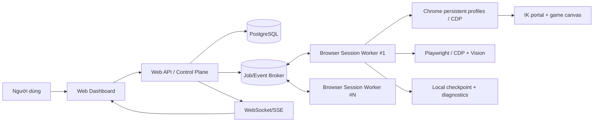

# Đặc tả Farm Automation Browser — Infinity Kingdom

> Tài liệu này thay thế hướng LDPlayer/ADB cho phiên bản browser. Bản đặc tả
> gốc được giữ nguyên tại `farm-automation-web-spec.md` chỉ để tham chiếu lịch
> sử; nó không còn là kiến trúc triển khai.

## 1. Phạm vi và nguyên tắc

- Tự động hóa diễn ra trong các Chrome profile đã đăng nhập hợp lệ vào portal
  IK và game web; không có LDPlayer, ADB, emulator hay mobile bridge.
- Một profile chỉ có một workflow được điều khiển tại một thời điểm bằng
  **profile lease** độc quyền.
- Mỗi cycle hoàn tất tối đa một dispatch đã được xác minh, sau đó yield để
  profile khác có cơ hội chạy.
- Browser/API chỉ gửi ý định đã validate. Browser Session Worker quyết định
  thao tác cụ thể theo frame/canvas mới nhất.
- Không thực hiện input từ state `Unknown`, frame stale, template yếu hoặc
  dialog chưa có workflow được duyệt.

## 2. Kiến trúc mục tiêu



`Browser Session Worker` chạy trên máy có Chrome và profile đăng nhập; kết nối
outbound TLS tới control plane. Browser không được cấp CDP endpoint, profile
folder, cookie hay quyền input trực tiếp từ Internet.

## 3. Thực thể và contract

| Thực thể | Mục đích |
| --- | --- |
| `browser_workers` | Host, version, capability Playwright/CDP, heartbeat. |
| `browser_profiles` | Profile Chrome được quản lý/CDP, owner worker, session health. |
| `farm_profiles` | Chính sách resource/level/team, retry/timeout và version. |
| `farm_runs` / `profile_runs` | Một yêu cầu farm và từng profile thuộc run. |
| `profile_events` | Event append-only, identity + sequence đơn điệu. |
| `profile_checkpoints` | Metadata khôi phục an toàn; restart luôn về `preflight`. |
| `audit_logs` | Actor, command, kết quả, idempotency key. |

Command từ web có `commandId`, `idempotencyKey`, `actorId`, `workerId`,
`profileIds`, `expectedVersion`, `requestedAt`, `deadlineAt` và payload đã
validate. Những command tối thiểu là `profile.discover`, `farm.start`,
`farm.stop`, `profile.pause`, `profile.resume`, `profile.quarantine`,
`profile.recover` và `diagnostic.capture`.

## 4. Browser Session Worker

Worker quản lý persistent Chrome context hoặc kết nối Chrome CDP đã được
whitelist. Nó không dùng `adb`, không gọi emulator process và không nhận raw
mouse/touch request từ dashboard.

```text
BrowserSessionAdapter
  discoverProfiles()
  openProfile(profile)
  healthCheck(profile)
  capturePageOrCanvas(profile)
  detectGameState(frame)
  guardedInput(profile, expectedState, templateId, postCondition)
  closeOrReconnect(profile)
```

`guardedInput` bắt buộc: cancellation check → capture frame mới (tối đa 500 ms)
→ detect expected state → rematch template/bounds → input qua Playwright/CDP →
capture mới → verify post-condition. Không có fallback click theo tọa độ cứng.

## 5. State và workflow bounded

Profile run có state: `queued`, `preflight`, `ready`, `running`, `waiting`,
`recovering`, `quarantined`, `stopped`.

`preflight` xác minh Chrome context còn sống, portal/game frame hợp lệ, World
Map và roster. `running` chỉ được vào sau khi profile lease cấp thành công.
Business outcome như không có team ready, resource hết, kho đầy hoặc resource
hết hạn chỉ schedule fallback/retry. Technical failure như Playwright/CDP
disconnect, capture lỗi, template timeout hay watchdog không progress mới vào
recovery ladder/circuit breaker.

Recovery browser theo thứ tự: reconnect CDP → chọn lại game page/frame → reload
có kiểm chứng → đóng/mở lại persistent context. Vượt policy thì quarantine;
không reload/tap mù từ checkpoint.

## 6. Concurrency, diagnostics và bảo mật

- Giới hạn song song theo worker: page/capture/vision/gameplay gates tách biệt.
- Profile lease có TTL, fencing generation, renewal và release khi stop.
- Event được coalesce, dashboard chỉ apply sequence mới hơn; reconnect bằng
  cursor/event sequence.
- Screenshot/diagnostic có quota, retention, checksum và signed URL; không log
  cookie, authorization header, CDP URL hay profile path nhạy cảm.
- Web dùng OIDC/session với `viewer`, `operator`, `admin`; worker dùng mTLS
  hoặc workload token ngắn hạn. Mọi mutation có audit, ownership và rate limit.

## 7. Lộ trình browser

1. Chuẩn hóa `BrowserProfile`/`BrowserSessionWorker` contracts và cập nhật docs.
2. Browser worker fake: profile lease, cancellation, checkpoint, event sequence.
3. Browser adapter Playwright/CDP: discover, health, page/canvas capture.
4. Control plane: PostgreSQL, audit, broker, API/RBAC và stream.
5. Port bounded workflow: World Map → roster → search → popup → team →
   verified dispatch.
6. Dashboard đa profile, telemetry, load/soak test và runbook browser recovery.
